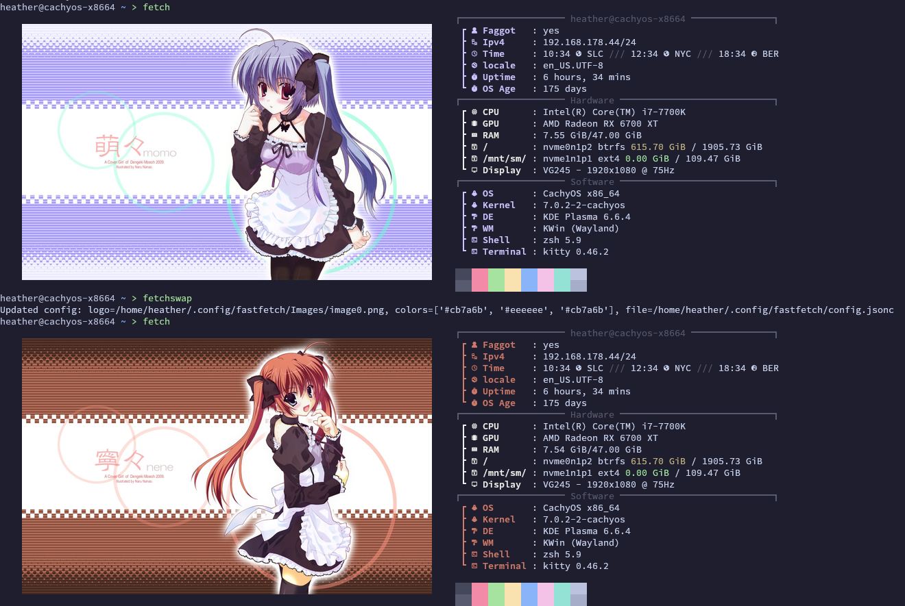
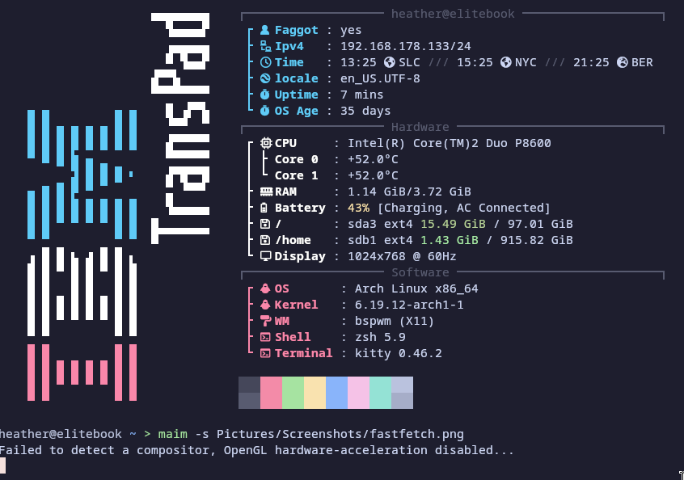
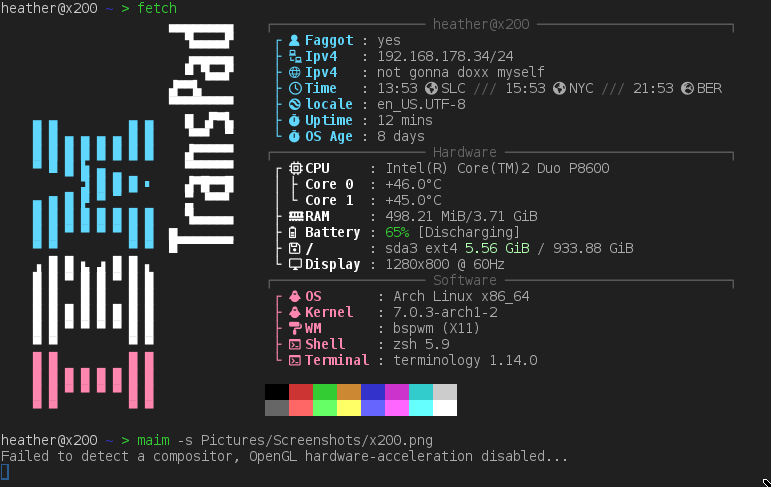
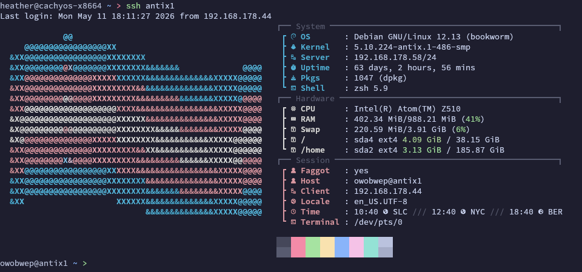

# Dotfiles managed by Chezmoi
Initiate on a new system with:
```zsh
chezmoi init --apply Hasseroeder
```

Or clone with:
```zsh
git clone https://github.com/Hasseroeder/dotfiles.git
```

### Pacman: 
```bash
sudo pacman -Syu --needed \
  unzip man-db man-pages tldr grep \
  git chezmoi zsh curl ca-certificates \
  fzf zoxide fastfetch neovim eza tree bat nethack nudoku btop htop \
  yazi xdg-utils mediainfo perl-image-exiftool imagemagick p7zip jq ripgrep fd \
  gawk coreutils python nodejs npm luarocks make cmake cargo 
```

### Apt:
```bash
sudo apt update
sudo apt install -y \
  unzip man-db man-pages tldr grep \
  git zsh curl ca-certificates \
  fzf zoxide fastfetch neovim eza tree bat nethack-console nudoku btop htop \
  yazi xdg-utils mediainfo libimage-exiftool-perl imagemagick p7zip-full jq ripgrep fd-find \
  gawk coreutils python3 nodejs npm luarocks make cmake cargo
```

### Additional Programs
NVM:
```bash
curl -o- https://raw.githubusercontent.com/nvm-sh/nvm/v0.40.4/install.sh | bash
```
Zinit:
```bash
bash -c "$(curl --fail --show-error --silent --location https://raw.githubusercontent.com/zdharma-continuum/zinit/HEAD/scripts/install.sh)"
```
Powerlevel10k
```bash
git clone --depth=1 https://github.com/romkatv/powerlevel10k.git "$HOME/.powerlevel10k"
```
OhMyZsh
```bash
sh -c "$(curl -fsSL https://raw.githubusercontent.com/ohmyzsh/ohmyzsh/master/tools/install.sh)"
```

## Machines
I currently have 5 machines configured with this, and a few others in the works.
| |
| --- |
| ### cachyos-x8664 - my main desktop computer |
|  |
||
||
| ### elitebook - an HP Elitebook 6930p |
|  |
||
||
| ### x200 - a Lenovo Thinkpad x200 |
|  |
||
||
| ### antix1 - a little piece of shit i386 SBC that I rescued |
|  |
||
||
| ### pi1 - which I use to host syncthing |
| Image |
||
||

<h3 style="margin-bottom:-1rem">Not Yet Online</h3>

- my old computer currently sitting in my closet
- my mom's old computer currently sitting in the garage
- a spare raspberry pi
- a spare i386 SBC that is just as big a piece of shit as antix1

## Packages
### Required
| Program | Repository |
| --- | --- |
| Git | [git/git](https://github.com/git/git) |
| chezmoi | [twpayne/chezmoi](https://github.com/twpayne/chezmoi) |
| Zsh | [zsh-users/zsh](https://github.com/zsh-users/zsh) |
| Oh My Zsh | [ohmyzsh/ohmyzsh](https://github.com/ohmyzsh/ohmyzsh) |
| Powerlevel10k | [romkatv/powerlevel10k](https://github.com/romkatv/powerlevel10k) |
| Zinit | [zdharma-continuum/zinit](https://github.com/zdharma-continuum/zinit) |

### Optional shell and terminal enhancements

These programs are guarded with `command -v`, file-existence checks, or directory checks. The dotfiles continue to work without them.

| Program| Repository |
| --- | --- |
| fzf | [junegunn/fzf](https://github.com/junegunn/fzf) |
| nvm | [nvm-sh/nvm](https://github.com/nvm-sh/nvm) |
| zoxide | [ajeetdsouza/zoxide](https://github.com/ajeetdsouza/zoxide) |
| fastfetch | [fastfetch-cli/fastfetch](https://github.com/fastfetch-cli/fastfetch) |
| Neovim | [neovim/neovim](https://github.com/neovim/neovim) |
| eza | [eza-community/eza](https://github.com/eza-community/eza) |
| tree | [Old-Man-Programmer/tree](https://github.com/Old-Man-Programmer/tree) |
| bat / batcat | [sharkdp/bat](https://github.com/sharkdp/bat) |
| nudoku | [jubalh/nudoku](https://github.com/jubalh/nudoku) |
| NetHack | [NetHack/NetHack](https://github.com/NetHack/NetHack) |

### Optional fastfetch support tools

`fastfetch` itself is optional, but when it is installed these configs expect the usual Unix tools below for custom command modules and the CachyOS logo swap helper.

| Program | Repository |
| --- | --- |
| GNU awk | [mitchcapper/gawk](https://github.com/mitchcapper/gawk) |
| GNU coreutils | [coreutils/coreutils](https://github.com/coreutils/coreutils) |
| Python 3 | [python/cpython](https://github.com/python/cpython) |

### Optional Yazi file-manager stack

The `.chezmoiignore` skips the Yazi config when `yazi` is not installed. If you install Yazi, the config can also use these helper programs for previews and openers.

| Program | Repository |
| --- | --- |
| Yazi | [sxyazi/yazi](https://github.com/sxyazi/yazi) |
| xdg-utils  | [freedesktop/xdg-utils](https://gitlab.freedesktop.org/xdg/xdg-utils) |
| MediaInfo | [MediaArea/MediaInfo](https://github.com/MediaArea/MediaInfo) |
| ExifTool | [exiftool/exiftool](https://github.com/exiftool/exiftool) |
| ImageMagick | [ImageMagick/ImageMagick](https://github.com/ImageMagick/ImageMagick) |
| p7zip / 7-Zip | [p7zip-project/p7zip](https://github.com/p7zip-project/p7zip) / [ip7z/7zip](https://github.com/ip7z/7zip) |
| jq | [jqlang/jq](https://github.com/jqlang/jq) |
| ripgrep |  [BurntSushi/ripgrep](https://github.com/BurntSushi/ripgrep) |
| fd | [sharkdp/fd](https://github.com/sharkdp/fd) |

### X11 / bspwm desktop stack

The `.chezmoiignore` skips the X11 desktop config unless chezmoi data sets `windowSystem` to `X11`. On an X11 machine using this profile, treat this whole stack as required for the desktop session.

Packman:
```bash 
sudo pacman -Syu --needed \
  xorg-server xorg-xinit \
  xorg-xrandr xorg-xset xorg-xsetroot xorg-xrdb xorg-setxkbmap \
  xorg-xinput xorg-xprop xorg-xdpyinfo xorg-xev \
  bspwm sxhkd polybar feh rofi \
  iproute2 firefox maim
```

Apt:
```bash
sudo apt update
sudo apt install -y \
  xorg xinit \
  x11-xserver-utils x11-utils x11-xkb-utils \
  bspwm sxhkd polybar feh rofi \
  iproute2 firefox
```

## Notes from `.chezmoiignore`

- `README.md` and `Screenshots/` are source-repo documentation only and are never applied to `$HOME`.
- Host-specific fastfetch configs are only applied to their matching hostnames.
- The CachyOS fastfetch image rotation files are only applied on `cachyos-x8664`.
